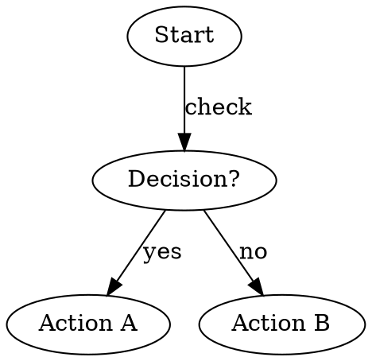

# Skill Name

## Overview

[Brief description of what this skill does in 1-2 sentences]

Core principle: [State the fundamental approach or philosophy]

## When to Use

Use this skill when:
- [Specific trigger or situation 1]
- [Specific trigger or situation 2]
- [Specific trigger or situation 3]

Do NOT use when:
- [Situation where skill doesn't apply]
- [Alternative approach is better]

## Core Principles/Patterns

### Principle 1

[Description]

**Do:**
- [Best practice 1]
- [Best practice 2]

**Don't:**
- [Anti-pattern 1]
- [Anti-pattern 2]

## Implementation

### Workflow

[If decision-making is non-obvious, include a small flowchart]



### Step-by-Step Guide

1. **Step 1** - [What to do]
2. **Step 2** - [What to do]
3. **Step 3** - [What to do]

## Quick Reference

| Situation | Action | Note |
|-----------|--------|------|
| [Scenario] | [What to do] | [Why/context] |
| [Scenario] | [What to do] | [Why/context] |

## Common Mistakes

| Mistake | Fix |
|---------|-----|
| [What goes wrong] | [How to correct it] |
| [What goes wrong] | [How to correct it] |

## Examples

### Example 1: [Scenario Name]

**Context:** [Brief setup]

**Approach:**
```
[Code, commands, or procedure]
```

**Result:** [What this accomplishes]

## Real-World Impact

[Optional: Concrete benefits or results from using this skill]